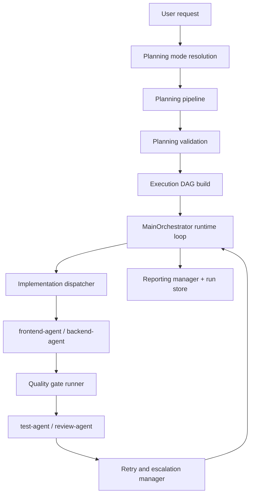

# Multi-Agent Coding Assistant Architecture

## 1. System Goal

This repository implements a layered orchestration kernel for multi-agent coding workflows on top of OpenClaw.
The current goal is not a fully autonomous platform.
It is to keep the core control loop reliable:

- classify a request into the right planning path
- produce a validated planning result
- turn that result into an execution DAG
- dispatch implementation work to the correct owner role
- run test/review quality gates
- recover through retry, escalation, and reporting

Current architecture priority:
**correctness > recoverability > traceability > breadth**

---

## 2. High-Level Architecture

Key points:
- `main-orchestrator` is the only global coordinator.
- Planning produces implementation tasks only.
- Quality gates run after implementation and can route work back as `needs_fix`.
- Retry and escalation decisions preserve per-task evidence and model context.

## 2.1 Product operating modes

The current architecture should now be read through three product-facing operating modes:

- `all-plan`: request to validated `planning result`
- `task-run`: validated `planning result` to runtime execution and reporting
- `end-to-end`: `all-plan` followed by `task-run`

These modes reuse the same layers below.
They do not introduce three separate orchestrators.

---

## 3. Layer Boundaries

| Layer | Responsibility | Primary modules | Must not do |
| --- | --- | --- | --- |
| Planning intake | decide whether and how planning runs | `src/planning/planning-mode-resolver.ts`, `src/planning/planning-controller.ts` | bypass validation or invent runtime statuses |
| Planning pipeline | direct/debate planning, synthesis, normalization | `src/planning/` | assign quality gates as task owners |
| Schema and validation | define safe contracts for planning and runtime | `src/schemas/`, `src/orchestrator/planning-validator.ts` | hide incompatible changes in untyped payloads |
| Execution graph | convert planning result into runtime nodes and edges | `src/orchestrator/dag-builder.ts` | treat quality roles as planned DAG nodes |
| Runtime orchestration | drive dispatch, quality gates, retries, blocking, persistence | `src/orchestrator/main-orchestrator.ts` | delegate global control to workers |
| Adapters and routing | resolve logical/exact models and shape OpenClaw envelopes | `src/adapters/` | lose model metadata during routing |
| Worker contracts | standardize execution context, blockers, and retry handoff | `src/workers/contracts.ts` | own orchestration policy |

---

## 4. Core Runtime Flow

## 4.1 Request to planning

`PlanningRequest` captures:
- user request
- project summary
- relevant context
- planning mode
- constraints
- budget policy
- existing artifacts

The planning layer resolves `auto` into either:
- `auto_resolved_direct`
- `auto_resolved_debate`

Direct mode routes one `planning-agent`.
Debate mode fans out to:
- `architecture-planner`
- `engineering-planner`
- `integration-planner`

The final output is a normalized `PlanningResult`.

This phase is the core of `all-plan`.

## 4.2 Planning result to DAG

Validated planning results are converted into runtime nodes with:
- implementation owner
- model selection
- dependency edges
- quality-gate requirements
- retry policy
- reporting-friendly runtime state

Planning tasks remain implementation-only.
`test-agent` and `review-agent` are not DAG owners.

This DAG handoff is the contract between `all-plan` and `task-run`.

## 4.3 Runtime execution loop

`MainOrchestrator` drives the loop:
1. build and persist the initial runtime state
2. find ready implementation tasks
3. dispatch to `frontend-agent` or `backend-agent`
4. ingest implementation output and execution evidence
5. run `test-agent` and `review-agent` when required
6. decide retry, escalation, or terminal status
7. block downstream work when an upstream dependency is unrecoverable
8. produce a final summary

This is a dynamic DAG loop, not a one-shot batch dispatch.

This phase is the core of `task-run`.

---

## 5. Role Boundaries

### `main-orchestrator`
- owns global control flow
- persists runtime state
- records events
- blocks dependents on unrecoverable upstream outcomes

### Planning roles
- `planning-agent`
- `architecture-planner`
- `engineering-planner`
- `integration-planner`

These roles shape planning output and trace metadata.
They do not directly execute repository changes.

### Implementation roles
- `frontend-agent`
- `backend-agent`

These roles own planned implementation tasks.

### Quality roles
- `test-agent`
- `review-agent`

These roles evaluate completed implementation work.
They can return approval, repair pressure, or failure, but they do not become task owners.

---

## 6. Key Invariants

1. `main-orchestrator` is the only global controller.
2. Planning outputs only implementation tasks.
3. `assigned_agent` may only be `frontend-agent` or `backend-agent`.
4. Quality-gate roles are post-implementation evaluators.
5. `needs_fix`, `blocked`, and `failed` have distinct meanings.
6. Retry handoff must preserve changed files, blocker metadata, and prior evidence.
7. Logical model routing and exact-model metadata should stay aligned when available.

## 6.1 Mode-boundary invariants

1. `all-plan` must stop with a stable planning artifact.
2. `task-run` must be able to start from a stored `planning result`.
3. `end-to-end` must compose planning and execution without bypassing their contracts.
4. planner-side coordination belongs to planning, not the runtime DAG.
5. runtime quality gates belong to execution, not planning ownership.

---

## 7. Model Routing and Metadata

The repository currently recognizes these logical model families:
- `codex`
- `claude`
- `gemini`

The default OpenClaw catalog maps them to exact model ids:
- `openai-codex/gpt-5.4`
- `anthropic/claude-opus-4-6`
- `google-gemini-cli/gemini-3.1-pro-preview`

Architecture rules:
- routing may start from logical labels, aliases, or exact ids
- runtime state should preserve exact model metadata when available
- retry and escalation should carry the next selected model explicitly
- docs and tests should move together when catalog behavior changes

---

## 8. Failure and Recovery Semantics

### `needs_fix`
- implementation ran, but quality gates rejected the result
- should route back to the original owner with richer context

### `blocked`
- execution cannot continue because of missing requirements, environment, or failed dependencies
- may be recoverable or terminal depending on cause

### `failed`
- execution itself failed or exhausted retry budget
- may trigger same-model retry or upgraded-model retry before turning terminal

These statuses are not interchangeable.

---

## 9. Verification Surfaces

Primary verification lives in:
- `tests/planning-mode-resolution.test.mjs`
- `tests/planning-pipeline.test.mjs`
- `tests/orchestrator-runtime.test.mjs`
- `tests/openclaw-runtime-adapter.test.mjs`
- `tests/openclaw-model-resolution.test.mjs`

For architecture-affecting changes, review:
- runtime schemas
- affected planners/adapters/orchestrator modules
- the relevant tests
- any design docs in `docs/plans/`

---

## 10. Near-Term Evolution

The next useful steps are adjacent to the current MVP:
- schema hardening for planning results
- productizing `all-plan`, `task-run`, and `end-to-end` entry surfaces
- replacing mock worker execution with a real execution bridge
- richer persistence and checkpoint resume
- better reporting surfaces
- CLI or chat entry integration

Those changes should preserve the same core invariants rather than bypass them.
