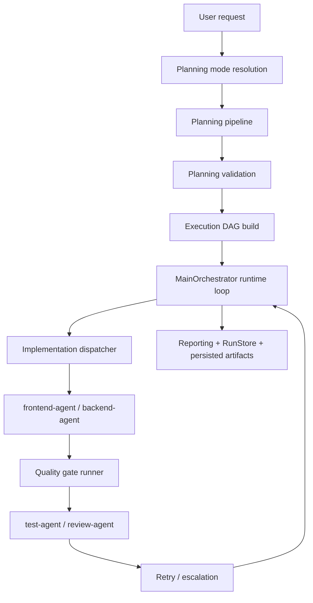

# Harness Engineering 框架 V2.1 详细讲解报告

**日期：** 2026-03-30  
**范围口径：** 基于 `main` 分支已合并内容，加上当前相关开放 PR 的设计与扩展文档  
**适用读者：** 项目维护者、新协作者、后续实现与评审 Agent

## 1. 这份报告讲什么

这份报告的目标，不是简单把 PR 描述原样搬过来，而是把当前项目里的 Harness Engineering 框架系统化讲清楚，并把版本迭代账本整理出来：

- 这个框架为什么存在
- 它当前由哪些部分组成
- 每一层分别承担什么职责
- `V1.0`、`V2.0`、`V2.1` 是怎么演进出来的
- 每个版本、每个关键 PR 分别补了什么能力
- 截止目前它已经能实现什么效果
- 哪些能力已经在 `main` 上落地，哪些仍处于开放 PR 的设计或补充阶段

这份文档可以作为项目内的中文总览材料，也可以作为后续继续演进 Harness 时的统一入口。

---

## 2. 版本口径与时间线

### 2.1 V1.0

你定义的 `V1.0` 对应：

- `PR #6`，于 **2026-03-17** 合并到 `main`

这一版的核心不是新增复杂运行时能力，而是先把仓库的 Harness Engineering 基础骨架建立起来：

- 根目录协作文档入口
- 产品目标文档
- 架构文档
- 任务模板
- 复发问题沉淀机制

可以把 `V1.0` 理解为：

> 先把“怎么协作、怎么描述任务、怎么约束边界、怎么防止知识只留在聊天里”这件事固定下来。

### 2.2 V2.0

你定义的 `V2.0` 由以下 PR 共同构成：

- 已合并到 `main`：
  - `PR #31`
  - `PR #33`
  - `PR #34`
  - `PR #35`
  - `PR #36`
  - `PR #37`
  - `PR #38`
  - `PR #41`
- 当前仍在 PR 但属于 `V2.0` 范围：
  - `PR #39`
  - `PR #28`
  - `PR #29`

这意味着 `V2.0` 不是单个 PR，而是一条完整的 Harness 增强主线。它的主题可以概括成三部分：

- 把 worker 执行前后的上下文、验证和重试信息做实
- 把 runtime 的恢复、观测和反馈回路做强
- 把“阶段纪律”和“任务运营层”作为下一层设计能力补进框架版图

### 2.3 V2.1

你定义的 `V2.1` 对应：

- `PR #40`

`PR #40` 当前定义的是下一阶段 Harness 设计方向，不是已经全部落地到 `main` 的实现集合。它把框架继续推进到：

- contract-aware
- capability-aware
- artifact-first

也就是让框架从“已经有强运行时控制能力”，继续迈向“能够为长链路任务提供更明确执行合同、按模型能力调节 Harness 深度、并把中间工件作为一等对象”的体系。

### 2.4 一个更准确的理解方式

如果按 **2026-03-30** 这个时点来描述当前状态，可以这样概括：

- `V1.0`：Harness 文档与协作骨架已完成，并已在 `main`
- `V2.0 core`：运行时成功率主线的大部分关键能力已在 `main`
- `V2.0 extended`：阶段纪律、任务运营视角、trace analyzer 等补充面已经形成文档化方向，其中一部分仍在开放 PR
- `V2.1`：更偏“下一代 Harness”设计层，已形成明确设计稿，但尚不是 `main` 已实现基线

### 2.5 版本迭代总账：每个版本到底做了什么

如果你最关心的是“我在每个版本里到底加了哪些东西”，优先看这一节。

#### V1.0：先把 Harness 的仓库内骨架搭起来

`V1.0` 对应 `PR #6`。这一版最重要的事，不是继续堆 runtime 功能，而是先把“协作规则、产品目标、架构边界、任务定义、复发问题沉淀”固化到仓库里。

| 文件 / 动作 | 做了什么 | 解决的问题 | 带来的结果 |
| --- | --- | --- | --- |
| `AGENTS.md` | 定义项目目标、阅读顺序、repo map、golden rules、验证要求、收尾与 PR 规则 | 后续 agent 很容易只靠聊天上下文开工，导致边界、优先级、验证要求不稳定 | 仓库有了正式的协作操作手册，后来的 Harness 演进有统一入口 |
| `PRODUCT.md` | 定义产品目标、核心用户、优先级、non-goals、success criteria、product rules | 容易把项目做成“什么都想加”的多 agent 试玩场，而不是聚焦 orchestrator kernel | 后续改动都能回到 `correctness > recoverability > traceability > contract clarity > breadth` 这个产品优先级上 |
| `ARCHITECTURE.md` | 把 request -> planning -> validation -> DAG -> runtime -> quality gate -> retry/reporting 的整条链路、层边界、角色边界、不变量写成正式架构文档 | 旧的 `docs/architecture.md` 只是一份过时且局部的快照，无法作为统一架构入口 | 仓库从“代码里能看出架构”变成“文档里先讲清架构，代码和测试再落地” |
| `docs/templates/task-template.md` | 规定非 trivial 任务必须写背景、目标、非目标、约束、合同检查、验收、风险、验证步骤 | 任务输入太模糊时，很容易出现越改越大、边写边改目标、没有验证闭环 | Harness 从一开始就把任务 framing 也纳入工程纪律 |
| `docs/reviews/recurring-issues.md` | 把高频 review 问题整理成“可沉淀、可复用”的仓库记忆 | 重要经验只留在 review comment 或聊天里，下一次还会重复犯错 | 复发问题可以被提升为 docs、tests、template 或 automation，而不是反复口头提醒 |
| `README.md` 更新 + 删除 `docs/architecture.md` | 把根文档入口统一到新的 Harness 骨架上，移除旧架构入口 | 仓库里存在多个架构入口时，后续一定会漂移 | `README -> PRODUCT/ARCHITECTURE/AGENTS` 的阅读顺序被固定下来 |

这一版的本质是：

> 先把 Harness 从“代码里隐含存在的规则”变成“仓库里显式存在的工作系统”。

所以如果你问 `V1` 时新增的 `PRODUCT.md` 和 `ARCHITECTURE.md` 分别有什么作用，可以直接记成：

- `PRODUCT.md` 负责回答“这个仓库现在到底要成为什么，以及什么暂时不做”
- `ARCHITECTURE.md` 负责回答“这套系统现在按什么边界和不变量运行”

#### V2.0：把骨架推进成一套以运行时成功率为中心的 Harness

`V2.0` 不是一个 PR，而是一串连续迭代。它的共同主题是：让 worker 在更好的上下文里执行、在更严格的检查下交付、在失败时以更聪明的方式恢复，并把运行证据沉淀出来。

| PR | 做了什么 | 解决的问题 | 带来的结果 |
| --- | --- | --- | --- |
| `PR #31` | 在 planning/runtime contract 里加入 `execution_guidance`，并打通 normalizer、validator、DAG propagation | 规划结果只有“谁做什么”，但缺少“执行时该怎么看代码、怎么验证、什么算完成” | Harness 开始携带执行指导，而不只是任务标题和 owner |
| `PR #33` | 新增 `runtime-context-builder` 和 `local-context-discovery`，把 repo context、环境发现、重试信息组合成运行时上下文 | worker 常常得从零重新摸索当前仓库状态，浪费轮次 | dispatch 前能生成更接近“开工就绪”的 task context |
| `PR #34` | 把 runtime context 真正穿到 OpenClaw / goose worker payload、recipe 和 implementation prompts | 上下文如果只停留在 orchestrator 内部，就不会改善真实执行 | `frontend-agent` / `backend-agent` 真正能收到 Harness 注入的上下文与指导 |
| `PR #35` | 建立 orchestrator-owned `runtime middleware` seam | pre-dispatch 注入、checklist、loop detection 这类逻辑如果没有正式挂点，就会散落在各层 | 后续运行时增强有了统一扩展面，且控制权仍在 `main-orchestrator` |
| `PR #36` | 引入 pre-completion checklist continuation，把“先自验证，再交给外部质量门”做成正式运行时行为 | worker 容易在没有 build/verify 证据时就宣称完成，导致外部质量门承担本该更早暴露的问题 | Harness 增加了一层内部自验证闭环，减少“看似完成、实际未验”的交付 |
| `PR #37` + `PR #41` | `#37` 把 PR12 重试诊断/循环检测从 roadmap 细化成可执行计划；`#41` 实现 bounded attempt history、failure diagnosis、reconsideration guidance、loop detection | retry 之前更像“带一点摘要重放”，无法识别是不是在重复同一种失败路径 | 重试开始带着诊断和历史重新开工，而不是机械地再来一次 |
| `PR #38` | 建立 structured runtime event schema，并同步 reporting / persistence / tests | 运行痕迹如果主要是自然语言日志，就很难做稳定分析 | run trace 从“人能读”提升到“机器也能分析、对比、统计” |
| `PR #39` | 在 `PR #38` 基础上继续补 repo-local run trace analyzer、CLI script、fixture 和文档流程 | 即使 event 结构化了，如果没有分析器，仍然很难把历史运行变成稳定反馈 | Harness 开始具备面向证据的 trace analysis 工作流；这一项属于 `V2.0 extended`，当前仍在开放 PR |
| `PR #28` | 吸收 Copilot Orchestra 的 workflow discipline 思路，设计阶段边界、暂停点、阶段级审计与交付纪律 | 当前 kernel 很强，但“大任务如何分阶段推进、何时暂停、如何审计阶段完成”还不够明确 | 为后续把 Harness 扩展成“更有节奏的交付系统”打了设计底稿；当前仍是开放设计 PR |
| `PR #29` | 吸收 systemprompt-code-orchestrator 的 task operations 思路，设计 task lifecycle、task/session、task-level report/operator surface | 当前系统偏 run-centric，任务本身还不是足够强的一等运营对象 | 为未来的 task registry、task report、task-centric inspection/cleanup/control surface 提供设计方向；当前仍是开放设计 PR |

如果把 `V2.0` 再压缩成一句话，它做的事就是：

> 让 Harness 不只会“把任务派出去”，而是会在派发前准备上下文、在交付前做自验证、在失败后做诊断恢复、并把整条运行轨迹沉淀成后续可分析的证据。

其中可以再拆成两层理解：

- `V2.0 core`：`PR #31/#33/#34/#35/#36/#37/#38/#41`，已经把 runtime-success 主链路的大部分关键能力落到了 `main`
- `V2.0 extended`：`PR #39/#28/#29`，把 trace analysis workflow、workflow discipline、task operations plane 继续外扩到更完整的 Harness 版图

#### V2.1：从“强运行时控制”继续推进到“合同感知 + 能力感知”

`V2.1` 对应 `PR #40`。这一版不是在 `V2.0` 上继续堆更多 guardrail，而是开始回答另一个问题：

> 当任务更长、模型能力更不稳定、交付链路更复杂时，Harness 该如何按任务风险和模型能力自适应地调整自身深度？

`PR #40` 的几个关键推进点是：

| 设计点 | 含义 | 想解决什么问题 |
| --- | --- | --- |
| `TaskExecutionContract` | 在真正 dispatch 之前，把某次 attempt 要交付什么、什么不做、怎么验收、风险看哪里，物化成一个运行时合同工件 | planning task 仍然偏高层，缺少“这一次尝试具体要交付什么”的 attempt-level contract |
| pre-dispatch contract check | 对高风险任务在开工前做一次受限合同检查 | 避免 worker 一开始就带着模糊、重复或不可验证的 scope 进入长执行链路 |
| capability-aware harness policy | Harness 深度不再默认固定，而是按模型能力、任务风险、任务类型决定要不要更重的 scaffold | 不是所有任务都值得同样重的流程，也不是所有模型都需要同样多的保护壳 |
| artifact-first handoff | 把 `task_execution_contract`、`implementation_attempt_report`、`qa_report`、`retry_diagnosis_report` 变成一等工件 | 长链路任务如果没有显式工件，很难稳定恢复、交接、比较和分析 |
| harness ablation workflow | 不只想着继续加 harness，还要验证哪些 scaffold 未来可以删掉 | 避免 Harness 只增长不收敛，始终维持最高复杂度 |

所以 `V2.1` 的本质不是“再多几条规则”，而是：

> 把 Harness 从一套固定流程，推进成一套能根据任务和模型能力动态调节深度、并以显式合同和工件驱动长链路执行的系统。

---

## 3. 这个项目里的 Harness，到底是什么

在这个项目里，Harness 不是一句泛化的“流程治理”，也不是简单的 Prompt 约束集合。  
它更准确的定义是：

> 一个围绕 `main-orchestrator` 建立起来的、可计划、可验证、可恢复、可追踪、可扩展的多 Agent 编码执行框架。

它试图解决的问题，不是“如何拥有更多 Agent”，而是：

- 如何把用户需求稳定转成实现任务
- 如何在执行前验证计划是否符合架构边界
- 如何把任务组织成带依赖关系的执行图
- 如何把实现交给正确的 owner
- 如何在实现完成后强制经过测试与评审
- 如何在失败、阻塞、需要修复时保持语义清晰
- 如何在重试时带上足够上下文，而不是机械重放
- 如何把运行痕迹沉淀成下次迭代 Harness 的证据

因此，这个 Harness 的核心不是“多 Agent”，而是：

- contract clarity
- runtime control
- recovery semantics
- quality loops
- traceable artifacts

---

## 4. 总体设计目标与长期原则

从 `README.md`、`PRODUCT.md`、`ARCHITECTURE.md` 和相关计划文档汇总来看，这套 Harness 目前遵守的总目标是：

> 把多 Agent 编码编排做成一个稳定、可检查、可恢复的 OpenClaw 原生执行内核。

它坚持的优先级是：

- correctness
- recoverability
- traceability
- contract clarity
- breadth

也就是说，这个框架宁可显得“更严格、更显式”，也不优先追求：

- 看起来更自动
- 角色更多
- 流程更花哨
- 抽象更宽泛

### 4.1 当前最重要的不变量

这套 Harness 里最关键的架构不变量有这些：

1. `main-orchestrator` 是唯一全局控制器
2. planning 只产出实现任务，不直接产出测试/评审 owner
3. `assigned_agent` 只能是 `frontend-agent` 或 `backend-agent`
4. `test-agent` 和 `review-agent` 是质量门，不是计划 owner
5. `needs_fix`、`blocked`、`failed` 是不同状态，不允许混用
6. retry 必须保留前次证据、失败诊断和上下文
7. model 的逻辑标签与 exact model metadata 需要对齐保存
8. 重要协作知识必须回写到仓库文档，而不是只存在聊天历史里

这几个不变量基本决定了整个项目的 Harness 边界。

---

## 5. 当前 Harness 的总体结构

从架构上看，当前框架可以抽象成下面这条主链路：

这条链路的重点不是“从左到右一次跑完”，而是它支持：

- 动态准备 ready task
- 质量门失败后回流
- retry 与模型升级
- 阻塞传播
- 持久化与 resume
- 事件记录与后续分析

所以这不是一个静态批处理流程，而是一个带恢复闭环的 runtime harness。

---

## 6. 组成部分逐层讲解

### 6.1 文档与协作基础层

这是 `V1.0` 最核心的贡献，也是整套 Harness 能稳定协作的前提。

主要文件：

- `AGENTS.md`
- `PRODUCT.md`
- `ARCHITECTURE.md`
- `docs/templates/task-template.md`
- `docs/reviews/recurring-issues.md`

这一层解决的是“仓库如何被持续、稳定地协作”：

- `AGENTS.md` 定义读文档顺序、任务执行规则、验证要求、PR 规则
- `PRODUCT.md` 定义产品目标、优先级、非目标和成功标准
- `ARCHITECTURE.md` 定义端到端架构与不变量
- `task-template.md` 约束非 trivial 任务必须明确背景、目标、非目标、约束、风险和验证
- `recurring-issues.md` 负责把反复出现的 review 失败沉淀为长期规则

它带来的效果是：

- 新协作者不需要先读聊天记录才能开始工作
- 后续 PR 的架构讨论有统一参照物
- planning/runtime 的边界不容易漂移

如果没有这层，后面的 runtime 能力再强，也很难形成长期可维护的 Harness。

### 6.2 Planning 层

主要模块：

- `src/planning/planning-mode-resolver.ts`
- `src/planning/planning-pipeline.ts`
- `src/planning/planning-controller.ts`
- `src/planning/planning-normalizer.ts`
- `src/planning/debate-synthesizer.ts`
- `src/planning/mock-planners.ts`
- `src/schemas/planning.ts`

这一层负责把用户需求转成结构化计划结果。

### Planning 层做的事

- 决定 planning 模式是 `direct`、`debate` 还是从 `auto` 自动解析
- 组织单规划器或多规划器辩论式规划流程
- 对 planning 结果做 normalization
- 把结果整理成后续 DAG 可消费的 `PlanningResult`

### 它强调的边界

- planning 输出必须仍然是实现任务
- 任务 owner 只能是 `frontend-agent` / `backend-agent`
- 质量门不在 planning 时变成 owner
- 跨前后端工作要拆开，而不是隐藏在一个任务里

### `V2.0` 对 Planning 层的增强

`PR #31` 引入了 `ExecutionGuidance` 合同，给每个 planning task 增加了更偏运行时的执行指引：

- `must_read_files`
- `verification_commands`
- `environment_checks`
- `definition_of_done`
- `reconsider_signals`

这一步很关键，因为它让 planning 不再只是“描述任务是什么”，还开始为运行时准备“这次执行应该关注什么”。

### 6.3 Planning Validation 与 DAG 构建层

主要模块：

- `src/orchestrator/planning-validator.ts`
- `src/orchestrator/dag-builder.ts`
- `src/schemas/runtime.ts`

这层的作用是把 planning 结果变成运行时真正可执行的图结构。

### DAG 构建层做的事

- 校验 planning 结果是否满足架构规则
- 为每个 task 生成运行时节点 `ExecutionNode`
- 建立依赖边
- 初始化 runtime snapshot
- 生成 ready task 集合

### 为什么这一层重要

Harness 的一个关键原则是：

> planning 结果不能直接拿来跑，必须先变成 runtime contract。

在这个项目里，`buildExecutionDag()` 不只是“构图”，它也是从设计阶段进入执行阶段的正式关口。

### `ExecutionNode` 当前已经承载的内容

除了最基础的任务信息外，当前 runtime node 已经保存了很多 Harness 关键字段：

- task 身份、owner、依赖、质量门
- model 与 `model_metadata`
- `execution_guidance`
- `retry_count` / `max_retries`
- `fallback_models`
- `blocker_category` / `blocker_message`
- `failure_category` / `failure_diagnosis`
- `reconsider_instructions`
- `repeated_pattern_summary`
- `checklist_feedback`
- `implementation_evidence`
- `test_evidence`
- `review_feedback`
- `commands_run`
- `test_results`
- `delivery_metadata`
- `prior_attempt`
- `attempt_history`

这说明当前 Harness 已经不是“只在状态机上挂几个字符串”，而是在把一次任务执行的关键信息结构化。

### 6.4 Runtime Orchestrator 层

主要模块：

- `src/orchestrator/main-orchestrator.ts`

这是整个框架的核心控制层。

### 它负责什么

- 接收 planning 结果并初始化 runtime
- 应用 policy
- 处理 approval gate
- 选择 ready task
- 调用 implementation dispatcher
- 在实现完成后进入 quality gates
- 根据结果决定 completed / needs_fix / blocked / failed
- 触发 retry 或模型升级
- 记录事件
- 保存持久化状态
- 支持 resume、pause、cancel

### 为什么说它是 Harness 的核心

因为项目明确规定：

> `main-orchestrator` 是唯一全局控制器。

这意味着：

- worker 不拥有全局调度权
- prompt 不拥有调度权
- retry 策略不散落在各 worker 内
- approval 不变成一个独立调度器
- 质量门不越权控制执行图

这使得整套系统虽然看起来模块很多，但真正的控制权始终收敛。

### 6.5 Runtime Context 注入层

主要模块：

- `src/orchestrator/runtime-context-builder.ts`
- `src/orchestrator/local-context-discovery.ts`
- `src/workers/contracts.ts`

这是 `V2.0` 里非常关键的一步。

### Runtime Context 注入层解决的问题

以前的典型问题是：

- worker 拿到任务后，需要自己再去摸索 repo
- 它不知道应该重点看哪些文件
- 它不清楚本地应该跑什么验证命令
- 重试时也不一定能知道前一次到底卡在哪里

`PR #33` 与 `PR #34` 把这个问题推进到一个更成熟的状态。

### 当前 runtime context 的构成

发给 worker 的上下文已经包含：

- `repo_context_summary`
- `environment_snapshot`
- `task_context_files`
- `verification_plan`
- `time_budget_hint`

其中 `verification_plan` 又包含：

- commands
- environment_checks
- definition_of_done
- reconsider_signals
- retry_handoff

这层带来的效果是：

- worker 不用每次从零探索仓库
- 执行输入更接近“可直接开始工作”
- 重试时能够继承之前的失败上下文

### 6.6 Runtime Middleware 层

主要模块：

- `src/orchestrator/runtime-middleware.ts`
- `src/orchestrator/pre-completion-checklist-middleware.ts`
- `src/orchestrator/loop-detection-middleware.ts`

`PR #35` 是 `V2.0 core` 非常重要的分水岭。

它把一类原来容易散落到各处的控制逻辑，统一放进了 orchestrator-owned middleware seam。

### Middleware 当前有哪些阶段

- `before_dispatch`
- `after_implementation_attempt`
- `before_quality_gates`

这意味着框架开始具备一个明确的 runtime 插入点，用来承载：

- dispatch 前的控制
- 实现后处理
- 进入质量门前的附加判断

而这些判断仍然属于 orchestrator，不属于 worker。

### 为什么这一步很重要

如果没有 middleware seam，后面的很多能力都会被迫做成：

- prompt 规则
- worker 内部逻辑
- goose recipe 局部逻辑

那样很难保证统一性，也很难做到“框架层可测试、可替换、可复用”。

### 6.7 Self-Verification / Pre-Completion Checklist 层

主要模块：

- `src/orchestrator/pre-completion-checklist-middleware.ts`
- `tests/orchestrator-precompletion-checklist.test.mjs`

`PR #36` 把一个很关键的 Harness 原则正式落地了：

> 实现 worker 不能在缺少验证证据时直接把任务交给外部质量门。

### 当前机制怎么工作

在 `before_quality_gates` 阶段：

- 读取任务的 `verification_commands`
- 对比 worker 真正执行过的 `commands_run`
- 如果缺少必要验证命令，就生成 `checklist_feedback`
- 返回 `continue_task`
- 把任务继续推回实现阶段，而不是立刻进入 `test-agent` / `review-agent`

### 这一层带来的效果

- 可以减少“代码写了，但没真正验证”的假完成
- 让外部质量门更聚焦于结果质量，而不是替代本地最基础的自检
- 把 build/verify/fix 回路前移

这一步对真实任务成功率很关键。

### 6.8 Implementation Dispatch 层

主要模块：

- `src/orchestrator/implementation-dispatcher.ts`
- `src/adapters/openclaw-runtime-adapter.ts`
- `src/adapters/goose-worker-adapter.ts`
- `src/adapters/goose-recipe-builder.ts`
- `src/adapters/goose-process-runner.ts`

这一层负责把 orchestrator 中的 runtime task 变成具体 worker 可执行的请求。

### 当前已经支持的两种形态

- mock dispatcher：用于测试与内核验证
- goose-backed dispatcher：用于真实的实现执行桥接

### OpenClaw runtime adapter 的作用

这一层把内部 runtime task 包装成 OpenClaw-facing envelope，包括：

- role
- model
- prompt reference
- payload
- metadata

对 worker 来说，输入里已经包含：

- task 基本信息
- runtime 基本状态
- `runtime_context`
- 历史执行上下文
- `prior_error`

### Goose worker adapter 的作用

它负责：

- 调用 goose recipe
- 解析结构化 worker 输出
- 归一化为框架内部可消费的执行结果

这意味着当前 Harness 并不是只有“架构设计”，它已经有一个清晰的执行桥。

### 6.9 Quality Gates 层

主要模块：

- `src/orchestrator/quality-gate-runner.ts`
- `prompts/test-agent.md`
- `prompts/review-agent.md`
- `prompts/review-agent-codex-exec.md`

这层负责在实现完成后做外部评估。

### 它的角色边界

- `test-agent`：测试类验证
- `review-agent`：代码评审类验证

但它们都不是计划 owner，也不是全局控制器。

### 它们可以产生什么结果

- `completed`
- `needs_fix`
- `failed`

如果是 `needs_fix`：

- 任务会回到原实现 owner
- 不会让质量门变成该任务的新 owner

这正是 Harness 与“松散多 Agent 对话流”最大的差别之一：  
评估者不会接管实现者的职责。

### 6.10 Retry / Escalation / Loop Detection 层

主要模块：

- `src/orchestrator/retry-escalation-manager.ts`
- `src/orchestrator/loop-detection-middleware.ts`
- `src/workers/contracts.ts`

`PR #41` 是 `V2.0 core` 中非常关键的一步。

### Retry / Escalation 层解决的问题

很多多 Agent 系统会把 retry 做成：

- 再试一次
- 或者换个模型再试一次

但没有明确说明：

- 上次为什么失败
- 是不是已经在重复同一路径
- 下一次应该故意避开什么

### 当前框架已经具备的能力

- `attempt_history`
- `prior_attempt`
- `failure_diagnosis`
- `reconsider_instructions`
- `repeated_pattern_summary`
- loop-detection middleware
- role-aware model fallback / escalation

### 这层的效果

- retry 不再只是原样重放
- 模型升级有结构化依据
- 下次 worker 能够知道自己不该重复什么
- runtime 报告里能更清楚地解释任务为什么卡住

这使得 Harness 的恢复能力比普通“失败就重跑”的编排器强很多。

### 6.11 Reporting / Structured Event / Persistence 层

主要模块：

- `src/orchestrator/reporting-manager.ts`
- `src/storage/run-store.ts`
- `src/storage/file-backed-run-store.ts`
- `src/schemas/runtime.ts`

这层决定了 Harness 是否真正“可检查、可恢复、可分析”。

### 当前已具备的能力

- `runtime.json` 作为完整 runtime snapshot
- `manifest.json` 作为紧凑运行元信息
- `events.jsonl` 作为运行事件流
- file-backed run store
- pause / cancel 请求持久化
- checkpoint-based resume

### `PR #38` 的关键贡献

`PR #38` 给 runtime event 引入了结构化 schema，包含：

- `phase`
- `attempt`
- `task_status`
- `failure_category`
- `model`
- `metadata`

这一步很关键，因为它把 event 从“主要给人看”推进成“也可以被工具读”。

### 当前 reporting 的意义

报告层不仅在做最终 summary，它还在为：

- resume
- retry diagnosis
- run-level inspection
- 后续 trace analysis

提供基础数据面。

### 6.12 Trace Analysis 与 Feedback Loop 层

这一层按你的 `V2.0` 定义属于整体框架的一部分，但在当前时点需要分两种状态看：

- `PR #38` 已把结构化 runtime event schema 合并到 `main`
- `PR #39` 仍在开放，但其目标是补上 repo-local trace analyzer 和 CLI 使用面

### 这层想解决什么

它不是为了在线调度，而是为了让 Harness 的后续演进可以基于证据。

也就是：

- 哪类 blocker 最常见
- 哪类 checklist 缺失最常见
- 哪些任务反复触发 retry loop
- 哪些模型更容易在什么 failure category 上失手

### 当前状态

从框架角度看：

- 结构化 event 基础已经到位
- analyzer 方向和脚本接口也已经设计明确
- 但 analyzer 本身仍属于开放 PR 所携带的扩展面

所以它是当前 `V2.0` 版图中的“已成型但未完全进入 main 基线”的部分。

### 6.13 Policy / Approval 层

主要模块：

- `src/orchestrator/policy-engine.ts`
- `src/orchestrator/approval-manager.ts`

这层的作用是把“执行限制”和“人工确认”从 worker 中剥离出来，保留在 orchestrator 层。

### 当前 policy engine 负责

- 最大并行度
- 默认重试预算
- 每任务重试预算覆盖
- 风险阈值
- role fallback policy

### 当前 approval manager 负责

- `auto-execute`
- `confirm-before-run`
- 审批前暂停
- 审批后恢复

这说明当前 Harness 已经开始具备“执行策略层”，而不是只有硬编码逻辑。

---

## 7. 现在这套 Harness 能实现什么效果

按当前 `main` 已合并内容，再加上你纳入 `V2.0` 的开放 PR 设计范围，这套 Harness 已经能够支撑以下效果：

### 7.1 从自然语言需求到结构化执行

它可以：

- 接受用户请求
- 判断走 `direct` 还是 `debate` planning
- 输出实现任务集合
- 校验计划合法性
- 构建依赖 DAG

### 7.2 把执行控制维持在框架层，而不是下放给 worker

它可以：

- 统一调度 ready task
- 处理依赖阻塞
- 控制 approval
- 控制 quality gate 入口
- 控制 retry 与模型升级

### 7.3 让 worker 在更接近“执行就绪”的上下文下工作

它可以：

- 注入必须读的文件
- 注入验证命令
- 注入环境检查
- 注入 definition of done
- 注入重试交接上下文

### 7.4 在外部质量门之前先做一次自验证闭环

它可以：

- 检查 worker 是否真的执行了要求的验证命令
- 在缺少验证证据时把任务打回继续做
- 避免把明显未验证的结果直接交给 `test-agent` / `review-agent`

### 7.5 在失败后做更聪明的恢复

它可以：

- 保留失败诊断
- 保留 blocker 类型
- 保留 attempt history
- 检测重复模式
- 给下次尝试添加 reconsider guidance
- 在需要时升级模型

### 7.6 让一次运行具备可暂停、可恢复、可审计的能力

它可以：

- 把 runtime 持久化到文件
- 记录事件流
- pause / cancel
- resume 到稳定 checkpoint
- 输出 run summary

### 7.7 为进一步的 Harness 迭代提供证据基础

它可以：

- 通过结构化 runtime events 留下分析接口
- 为 trace analyzer 提供输入面
- 支持未来把重复失败模式系统化沉淀到文档和计划里

---

## 8. `main` 已落地能力 vs 开放 PR 能力

这是当前最容易被讲混的一块，这里单独拆开。

### 8.1 已经在 `main` 的能力

截至 **2026-03-30**：

- `V1.0` 基础 Harness 文档骨架已在 `main`
- `PR #31` execution guidance 已在 `main`
- `PR #33` runtime context builder 已在 `main`
- `PR #34` worker payload threading 已在 `main`
- `PR #35` runtime middleware seam 已在 `main`
- `PR #36` pre-completion checklist continuation 已在 `main`
- `PR #37` PR12 计划文档已在 `main`
- `PR #38` structured runtime event schema 已在 `main`
- `PR #41` retry diagnosis and loop detection 已在 `main`

也就是说，当前 `main` 已经具备一套相当完整的 `V2.0 core` Harness 运行时内核。

### 8.2 当前仍在开放 PR、但属于你定义的当前框架版图

#### `PR #28`

补充的是：

- workflow discipline 视角
- 阶段边界
- 强制暂停点
- 阶段级审计工件

它更像是对“交付节奏层”的设计增强。

#### `PR #29`

补充的是：

- task lifecycle
- task/session
- task-level event stream
- task report
- task-centric operator surface

它更像是对“任务运营层”的设计增强。

#### `PR #39`

补充的是：

- run-trace analyzer
- 本地 CLI 分析脚本
- 让 persisted events 真正变成 Harness 改进输入

它更像是“结构化事件之上的可操作分析层”。

### 8.3 `V2.1` 当前状态

`PR #40` 定义的 `V2.1` 目前是明确设计，不是完整实现基线。

它提出的下一阶段重点是：

- `TaskExecutionContract`
- pre-dispatch contract check
- capability-aware harness policy
- artifact-first task attempt reporting
- harness ablation workflow

可以把它理解为：

> 在 `V2.0 core` 已经把 runtime 成功率与恢复闭环做强之后，进一步让 Harness 对“长任务、多轮次、不同模型能力边界”更敏感、更结构化。

---

## 9. 一个典型工作流是怎么跑的

为了更直观看这套 Harness，下面用一个典型流程说明。

### 第一步：用户提出需求

例如用户要求：

- 增加一个前端页面功能
- 补一个后端接口
- 修改一条跨模块的行为规则

### 第二步：进入 planning

系统会：

- 判定 planning mode
- 产出实现任务
- 为每个任务指定 `frontend-agent` 或 `backend-agent`
- 给出依赖关系、验收标准、质量门需求
- 在 `V2.0` 下附上 execution guidance

### 第三步：planning 结果被验证并转成 runtime DAG

系统会：

- 拒绝不符合边界的 planning 结果
- 生成 runtime nodes
- 初始化 retry、quality gate、evidence、attempt history 等字段

### 第四步：orchestrator 选择 ready task

系统会：

- 应用 policy
- 检查 approval
- 找出 ready task
- 进入 dispatch

### 第五步：worker 在运行时上下文下执行

发给 worker 的输入不只是任务标题，而是：

- repo context 摘要
- 必读文件
- 验证命令
- 环境检查
- definition of done
- 前一次失败交接信息

### 第六步：进入 pre-completion checklist

worker 交回结果后，系统不会立刻交给质量门，而是先检查：

- 该跑的验证命令是不是跑了
- 命令证据有没有留下

如果没有：

- 生成 checklist feedback
- 继续把任务推回实现 owner

### 第七步：进入质量门

只有在通过前置自验证后，才会进入：

- `test-agent`
- `review-agent`

它们会给出：

- 通过
- 需要修复
- 失败

### 第八步：失败时进入恢复闭环

如果失败或需要修复，系统会：

- 更新 failure diagnosis
- 写入 blocker / review feedback / evidence
- 判断是否触发 retry
- 必要时切换模型
- 在 loop detection 下添加 reconsider guidance

### 第九步：结果被持久化并沉淀为后续证据

运行过程中：

- runtime snapshot 被保存
- 事件被记录
- 最终 summary 被输出

如果再叠加 `PR #39` 的 analyzer 视角，未来还能把这些事件汇总成更高层的失败模式报告。

---

## 10. 为什么说这是一个比较成熟的 Harness，而不只是一些文档和 Prompt

因为它已经同时具备了下面几个层面的东西：

### 10.1 有架构边界

- 谁负责 planning
- 谁负责实现
- 谁负责测试和评审
- 谁掌握全局控制权

这些都已经被固定下来。

### 10.2 有运行时合同

- `PlanningResult`
- `ExecutionNode`
- `RuntimeState`
- `WorkerExecutionContext`
- `OpenClawRoleRequestEnvelope`

这些结构不是随意拼出来的字符串，而是稳定合同。

### 10.3 有恢复语义

- `needs_fix`
- `blocked`
- `failed`
- retry decision
- fallback model
- reconsider instructions

这些让系统具备真正的恢复闭环，而不是只会报错。

### 10.4 有质量闭环

- pre-completion checklist
- external quality gates
- needs-fix 回流

这让它不是一个“只管把活发出去”的编排器。

### 10.5 有可追踪工件

- manifest
- runtime snapshot
- events
- summary

这让它可以被审计、被恢复、被继续分析。

---

## 11. 当前这套框架最适合的场景

### 适合

- 需要把需求先规划再执行的编码任务
- 有明确前后端 owner 边界的任务
- 需要测试/评审质量门的任务
- 需要保留重试和诊断上下文的任务
- 希望把运行结果沉淀成后续优化依据的任务

### 暂时不适合

- 依赖大量自由探索、边界极不明确的任务
- 需要复杂远程任务运营平台能力的场景
- 需要长期自治 swarm 式 Agent 群的场景
- 尚未定义清楚验收标准和 owner 边界的任务

换句话说，它更适合做“高约束、高可审计”的工程执行框架，而不是一个无限自由的 autonomous agent playground。

---

## 12. 当前边界与仍未完成的部分

即使到 `V2.1` 设计口径，这套 Harness 也不是“已经彻底完成”。

### 12.1 还在开放设计或补强中的部分

- 阶段化交付与阶段暂停点的正式 runtime 物化
- task-centric operator surface
- trace analyzer 正式并入 `main`
- capability-aware harness policy
- execution contract artifact
- artifact-first task attempt reporting
- harness ablation workflow

### 12.2 当前仍然刻意不做的事

- 第二个全局调度器
- 让 quality gate 变成任务 owner
- 把 worker 变成全局控制器
- 用 prompt 取代 typed orchestrator kernel
- 把系统变成长生命周期 swarm

这说明当前框架并不是“能力还不够所以没做”，而是有意识地维持边界。

---

## 13. 版本总结

如果用一句话总结三个版本：

### V1.0

> 把 Harness 的协作骨架固定下来，让仓库有统一入口、统一规则、统一任务模板和统一 review 记忆面。

### V2.0

> 把 Harness 从“有骨架的 orchestrator”推进到“有运行时上下文、自验证、重试诊断、结构化事件和恢复闭环的执行内核”。

### V2.1

> 在 `V2.0 core` 基础上，继续朝 contract-aware、capability-aware、artifact-first 的长任务 Harness 演进。

---

## 14. PR 映射附录

| PR | 版本归属 | 状态 | 作用 |
| --- | --- | --- | --- |
| `#6` | `V1.0` | 已合并 | 建立 Harness Engineering 文档与协作骨架 |
| `#31` | `V2.0` | 已合并 | 引入 `ExecutionGuidance` 合同 |
| `#33` | `V2.0` | 已合并 | 引入 runtime context builder 与本地发现 |
| `#34` | `V2.0` | 已合并 | 把 runtime context 串到 worker payload / goose |
| `#35` | `V2.0` | 已合并 | 建立 runtime middleware seam |
| `#36` | `V2.0` | 已合并 | 引入 pre-completion checklist continuation |
| `#37` | `V2.0` | 已合并 | 补充 retry diagnosis / loop detection 实施计划 |
| `#38` | `V2.0` | 已合并 | 引入 structured runtime event schema |
| `#41` | `V2.0` | 已合并 | 引入 retry diagnosis 与 loop detection 实现 |
| `#39` | `V2.0` | 开放 PR | 引入 trace analyzer 与本地分析脚本 |
| `#28` | `V2.0` | 开放 PR | 引入 workflow discipline / 阶段化交付视角 |
| `#29` | `V2.0` | 开放 PR | 引入 task operations / 任务运营层视角 |
| `#40` | `V2.1` | 开放 PR | 定义 contract-aware / capability-aware / artifact-first 的下一阶段 Harness |

---

## 15. 最后的判断

按你当前定义的口径，到 **2026-03-30** 为止，这个项目的 Harness Engineering 框架已经不是“一个 orchestrator MVP 加几篇设计稿”，而是：

- 有明确协作规则
- 有 typed contracts
- 有运行时控制循环
- 有质量闭环
- 有恢复闭环
- 有持久化与 resume
- 有结构化事件基础
- 有进一步演进到 `V2.1` 的明确设计方向

它的成熟点在于：

- 已经知道哪些能力该放在 orchestrator
- 哪些该放在 worker
- 哪些必须用合同表达
- 哪些必须沉淀成工件

这正是一个 Harness 框架真正开始成型的标志。
