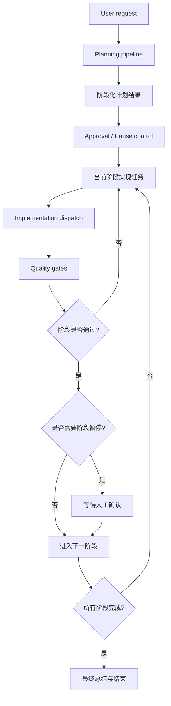

# Copilot Orchestra 工作流纪律融合设计

**日期：** 2026-03-22  
**类型：** 外部参考融合设计  
**语言：** 中文

## 1. 目标

本设计文档的目标不是引入另一个编排框架，而是从 `GitHub Copilot Orchestra` 中吸收一组已经被验证有价值的“交付纪律”，并将其融合到本仓库当前的多阶段自动化编码工作流中。

本次借鉴的重点不是“多 Agent”本身，而是以下几类工作流规则：

- 明确的阶段边界
- 强制暂停点
- 每个阶段内的小闭环
- 计划批准后再执行
- 每个阶段都有可追溯的完成记录

本设计面向当前仓库的现实目标：

- 提高真实任务的成功率
- 减少 AI 在长流程中的偏移
- 保持工作流可恢复、可解释、可审核

## 2. 参考来源

参考项目：

- `GitHub Copilot Orchestra`
- 仓库地址：<https://github.com/ShepAlderson/copilot-orchestra>

该项目当前公开 README 中强调的核心做法可以概括为：

- `planning -> implementation -> review -> commit` 的严格阶段流程
- 每个阶段使用专门角色
- 强制 TDD
- 质量门在每个阶段后执行
- 在计划批准和阶段提交处设置强制暂停点
- 把计划、阶段完成记录、最终完成记录写成文档

## 3. 我们准备借什么

本仓库准备借鉴的是“工作流纪律”，不是它的整套代理实现方式。

### 3.1 借鉴项

准备借入当前仓库的内容：

- `阶段化交付`
  - 不只是一口气从 planning 跑到完成，而是将一次较大的任务显式拆成若干阶段性成果。
- `计划批准后再执行`
  - 当前仓库已经有 approval controls，但可进一步收紧为“计划是正式可执行合同”的使用方式。
- `每阶段 implement -> review -> continue/stop 的小闭环`
  - 当前仓库已有 implementation 和 quality gates，但阶段粒度的“完成一个交付片段再进入下一片段”的纪律还不够强。
- `强制暂停点`
  - 不是所有任务都必须无条件自动连跑到底。
- `阶段产物文档化`
  - 让计划、阶段完成总结、最终完成总结成为正式工件，而不是只留在运行日志里。

### 3.2 明确不借鉴的内容

这次不准备借入以下部分：

- 不引入它的 VS Code / Copilot 自定义 agent 运行模式
- 不复制它的具体 agent 文件组织
- 不把本仓库改造成“Conductor + 三个 subagent prompt 文件”的简化结构
- 不把当前 typed orchestrator kernel 替换成对话式 conductor 模式
- 不强行把所有任务都改造成固定的 3-10 phase 文档驱动开发

原因很简单：

- 当前仓库已经有更强的 runtime contract、状态管理、重试语义、审批和持久化能力
- 我们需要吸收“纪律”，而不是退回到更轻量的 prompt orchestration

## 4. 当前仓库适合融合的位置

`Copilot Orchestra` 的价值不在新的 runtime 基建，而在更严格的“交付流程约束”。

因此，适合融合的模块是以下几层。

### 4.1 `planning`

适合融合的内容：

- 让 planning 在不越权的前提下，给出更适合阶段化交付的任务拆分
- 对较大的 epic 提供更清晰的任务组线索，帮助 orchestrator 识别潜在阶段边界
- planning 可以提供阶段化提示，但正式的阶段边界必须在 runtime 初始化时被显式物化并持久化，不能只依赖软提示重新推断

建议融合点：

- `src/planning/planning-normalizer.ts`
- `src/orchestrator/planning-validator.ts`
- `src/schemas/planning.ts` 中现有的实现任务与备注语义
- `src/orchestrator/dag-builder.ts` 中把阶段边界物化为初始 execution graph / runtime state 的位置

### 4.2 `approval / execution control`

适合融合的内容：

- 不仅支持 run 级别的 `confirm-before-run`
- 还要考虑阶段级别的暂停点
- 阶段完成后是否继续下一阶段，仍由 orchestrator 执行，但其暂停/顺序规则应由 runtime policy 明确表达
- 阶段顺序与暂停策略应当是 runtime policy，而不是 planning owner 的职责
- approval manager 只负责“是否获得确认”，不负责定义阶段推进策略

建议融合点：

- `src/orchestrator/policy-engine.ts`
- `src/orchestrator/approval-manager.ts`
- `src/schemas/runtime.ts`
- `src/orchestrator/main-orchestrator.ts`

### 4.3 `quality gates`

适合融合的内容：

- 质量门不只是最后的结果检查
- 质量门应提供 task 级完成与修复信号，供 orchestrator 判断当前阶段是否可以推进
- review 结果如果是 `needs_fix`，仍然默认回到原任务 owner 和原任务证据上下文，而不是放大成整个阶段重跑
- 阶段推进条件应当是“当前阶段内所有任务完成”，而不是“任一任务失败时整阶段回退”

建议融合点：

- `src/orchestrator/quality-gate-runner.ts`
- `src/orchestrator/main-orchestrator.ts`
- `src/orchestrator/policy-engine.ts`
- `src/workers/contracts.ts`

### 4.4 `reporting / persisted artifacts`

适合融合的内容：

- 记录阶段完成摘要
- 明确当前卡在哪个阶段
- 为最终交付保留阶段审计轨迹

建议融合点：

- `src/storage/run-store.ts`
- `src/orchestrator/reporting-manager.ts`
- `src/storage/file-backed-run-store.ts`
- `src/schemas/runtime.ts` 与 `RunManifest` 所定义的持久化结构
- `RUNTIME_STORAGE_VERSION` 与 resume 兼容策略

## 5. 融合后的结构

这次融合后的目标结构不是替换现有系统，而是在现有系统中增加一层“工作流纪律壳”。

关键变化是：

- 当前 orchestrator 仍然是唯一全局控制器
- `frontend-agent` / `backend-agent` 仍然只做实现
- `test-agent` / `review-agent` 仍然是质量门
- 新增的是“由 DAG build / runtime 初始化显式持久化的阶段边界”和“由 policy engine 管理的阶段暂停规则”

## 6. 这套融合后怎么使用

对使用者来说，融合后的体验应当是：

### 6.1 在任务开始前

用户提交需求后：

- planning 产出更适合阶段化交付的任务拆分与依赖结构
- orchestrator 基于任务组、依赖和 runtime policy 决定阶段边界
- `buildExecutionDag` / runtime 初始化在正式开始执行前，把阶段边界物化成可持久化的 milestone / task-group 工件
- orchestrator 在执行前展示或记录阶段边界

### 6.2 在任务执行中

每个阶段都遵循：

- 以 task 为单位实现当前阶段目标
- 运行质量门
- 必要时回到对应任务做修复
- 阶段完成后记录摘要
- 根据策略自动继续或暂停等待确认

### 6.3 在任务结束后

用户可以看到：

- 初始计划
- 每个阶段做了什么
- 每个阶段是否经过 review / test
- 最终交付结果和剩余风险

## 7. 推荐的最小融合方案

为了避免一次改动过大，建议按以下顺序逐步吸收 `Copilot Orchestra` 的工作流纪律。

### 第一步：阶段级暂停点

先引入最小变更：

- 在 runtime 里增加“阶段完成后是否暂停”的控制位
- 让阶段边界成为正式状态，而不是隐含行为

### 第二步：阶段完成记录

再增加：

- 阶段级完成摘要
- 阶段级审计轨迹

### 第三步：阶段内 review 回路

最后增强：

- 让 `needs_fix` 明确地回到原任务 owner 和原任务证据上下文
- 同时由阶段进度判断逻辑阻止未完成阶段被错误推进

## 8. 与当前仓库的兼容性判断

该设计与当前架构是兼容的，因为它增强的是“执行纪律”，不是重写 runtime。

兼容的原因：

- 当前仓库已经有 planning、approval、quality gate、retry、reporting
- 我们只是把这些已有能力按“阶段”组织得更紧
- `main-orchestrator` 的唯一控制权不变
- policy 仍集中在 `policy-engine`，不是散落到 approval 或 worker 层

潜在风险：

- 如果阶段粒度定义过细，会让流程变得啰嗦
- 如果阶段暂停过多，会拖慢自动化效率
- 如果阶段状态和现有任务状态混在一起，可能让语义变乱

因此建议：

- 把“阶段”建模为 runtime 初始化后显式持久化的 task group / milestone，而不是依赖软提示重算
- 保持 task status 与 milestone progress 两套语义分层存在，不让 `needs_fix` 扩大成阶段级重跑
- 让 `RunStore`、runtime schema 与 file-backed store 一起演进，而不是只在磁盘目录上临时加工件

## 9. 与并行的 harness 增强工作的关系

这份设计与其他偏 runtime 质量提升的 harness 增强工作存在交集，但关注点不同。

### 9.1 交集

交集在于：

- 都试图提升真实任务成功率
- 都不打算替换现有 orchestrator
- 都会落到 planning、runtime、reporting 等模块

### 9.2 差异

其他偏 runtime 质量提升的工作，通常更关注：

- context injection
- self-verification
- retry diagnosis
- trace analysis

本设计更关注：

- workflow discipline
- 阶段边界
- 阶段暂停点
- 阶段级审计工件

一句话概括：

- runtime 质量增强主要解决“任务怎么更容易做对”
- 本设计主要解决“任务怎么更有节奏地交付”

### 9.3 建议的融合方式

最合理的方式不是把这份设计单独做成一条与其他 runtime 增强竞争的主线，而是：

- 先把这份设计作为独立参考文档 PR 落地
- 后续真正实现时，只吸收其中与当前 contracts 不冲突的部分
- 始终保持 `main-orchestrator`、quality gates 与 approval policy 的现有边界

## 10. 审核清单

评审本设计时，建议重点检查：

- 是否清楚区分了“借 workflow 纪律”与“替换 runtime 架构”
- 是否明确标出了融合点而不是泛泛而谈
- 是否把阶段顺序与暂停策略正确地保留在 orchestrator/runtime policy 一侧
- 是否把阶段边界设计成可持久化、可恢复的显式 runtime contract
- 是否把阶段物化放在 DAG build / runtime 初始化层，而不是只停留在 planning hints
- 是否避免削弱现有 `test-agent` / `review-agent` 的边界
- 是否保持 `needs_fix` 的 task 级修复语义不被放大
- 是否让 `RunStore`、schema version 与 resume 兼容一起考虑
- 是否避免把阶段机制做成一套过重的新状态机
- 是否在不依赖外部 PR 背景的情况下仍然可读、可实施

## 11. 结论

`Copilot Orchestra` 最值得本仓库借鉴的，不是其 agent 形态，而是其工作流纪律：

- 阶段化交付
- 强制暂停点
- implement -> review -> continue 的小闭环
- 阶段级文档化审计

这些能力适合被融合进当前仓库已有的 planning、approval、quality gate、reporting 层，而不适合替换当前 typed orchestrator kernel。
