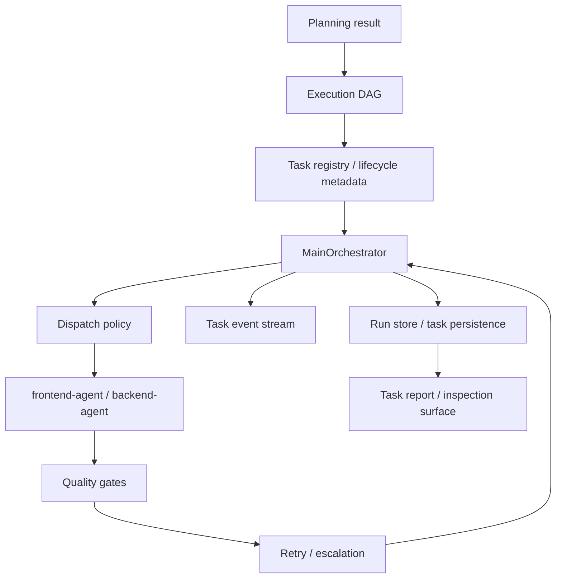

# systemprompt-code-orchestrator 任务运营层融合设计

**日期：** 2026-03-22  
**类型：** 外部参考融合设计  
**语言：** 中文

## 1. 目标

本设计文档的目标是从 `systemprompt-code-orchestrator` 中借鉴“任务运营层”能力，并将其融合到当前仓库已有的 orchestrator kernel 中。

这里说的“任务运营层”不是指新的 agent 能力，而是指以下几类基础设施：

- 明确的 task lifecycle
- task/session 隔离
- 可追踪的任务级事件
- 可查询、可汇总、可恢复的任务状态
- 面向操作员的任务检查与报告能力

本设计特别适合当前仓库的现状：

- 已经有 planning、DAG、dispatch、quality gates、retry、persistence
- 但 task management surface 还不够完整
- 调度现在主要是围绕 ready task 与前后端 agent 分派
- 用户还缺少更强的“任务运营视角”

## 2. 参考来源

参考项目：

- `systemprompt-code-orchestrator`
- 仓库地址：<https://github.com/systempromptio/systemprompt-code-orchestrator>

该项目当前公开 README 中最值得本仓库关注的部分，不是其远程访问产品形态，而是这些任务运营能力：

- `create_task`
- `update_task`
- `end_task`
- `report_task`
- session isolation
- persistent state
- event streaming
- 结构化任务状态机

## 3. 我们准备借什么

本仓库准备借入的是“任务运营层模型”，不是它的整套产品基础设施。

### 3.1 借鉴项

准备借入当前仓库的内容：

- `显式 task lifecycle`
  - 让任务不只是 runtime 中的一条 node 记录，还拥有更清楚的运营状态和操作面。
- `task session`
  - 让每个任务拥有更明确的会话/执行上下文边界，便于追踪、恢复、报告和重试。
- `task-level event stream`
  - 不只记录 run-level message，也能稳定汇总单个任务发生了什么。
- `task report`
  - 面向操作者输出单任务或多任务报告，而不只是最终 run summary。
- `task inspection / cleanup / control surface`
  - 未来可以支持列出任务、查看任务、恢复任务、清理旧任务等操作。

### 3.2 明确不借鉴的内容

这次不准备借入以下部分：

- 不引入 MCP server 暴露层
- 不引入 Docker daemon / host bridge 架构
- 不引入 remote tunnel、移动端、push notification
- 不把本仓库改造成远程可控开发工作站
- 不引入第二个全局任务协调器

原因：

- 当前仓库的目标是自动化编码工作流 kernel，不是远程控制产品
- 这些能力会显著增加系统复杂度，但对当前成功率提升帮助有限

## 4. 当前仓库适合融合的位置

`systemprompt-code-orchestrator` 最值得借的，是“任务作为一等运营对象”的设计。

因此适合融合的位置如下。

### 4.1 `runtime schema`

适合融合的内容：

- 为任务增加更明确的 lifecycle / session / report 视角
- 区分：
  - runtime task state
  - task operation metadata
  - task report material

建议融合点：

- `src/schemas/runtime.ts`
- `src/workers/contracts.ts`

### 4.2 `run store / persistence`

适合融合的内容：

- 让任务状态、任务事件、任务会话摘要更容易单独读取
- 提供 task-centric 的持久化访问面
- 保持与现有 `RunStore` abstraction 一致，而不是只强化 file-backed 细节

建议融合点：

- `src/storage/run-store.ts`
- `src/storage/file-backed-run-store.ts`
- `src/schemas/runtime.ts`

### 4.3 `reporting / event model`

适合融合的内容：

- 让 event 不只服务于最终 run summary
- 还可以支持：
  - 单任务报告
  - 多任务聚合报告
  - 任务历史追踪

建议融合点：

- `src/orchestrator/reporting-manager.ts`
- 新的 task reporting helper 模块

### 4.4 `scheduler / dispatch preparation`

适合融合的内容：

- 在不替换现有 `buildExecutionDag` 的前提下
- 增强 ready task 选择前的 task registry / task queue 能力
- 让 dispatch 决策更多基于任务运营状态，而不是只看是否 ready

建议融合点：

- `src/orchestrator/dag-builder.ts`
- `src/orchestrator/policy-engine.ts`
- `src/orchestrator/implementation-dispatcher.ts`
- `src/orchestrator/main-orchestrator.ts`

### 4.5 `CLI / operator surface`

适合融合的内容：

- 增加任务级查询和报告命令
- 让使用者可以直接操作任务，而不仅是 run

建议融合点：

- `src/cli/main.ts`
- 新的 task operations command helpers

## 5. 融合后的结构

融合后的目标结构不是“替换现有 orchestrator”，而是在其下方补出一个更清晰的 task operations plane。

关键变化：

- `main-orchestrator` 仍然是唯一全局控制器
- task operations plane 是其配套基础设施，不是新的 coordinator
- DAG 仍然负责依赖结构
- task registry / task session 负责任务运营视角

## 6. 融合后怎么使用

对仓库使用者来说，融合后的体验应当是：

### 6.1 运行开始后

除了得到 run id，还能稳定拿到：

- 当前有哪些任务
- 每个任务属于哪个 session / attempt
- 哪个任务正在运行
- 哪个任务在等待修复、阻塞或人工介入

### 6.2 运行过程中

操作者可以更方便地：

- 查看某个任务的完整执行轨迹
- 查看某个任务的最近一次 attempt
- 汇总某个任务执行过哪些命令、遇到哪些 blocker、收到了哪些 review feedback

### 6.3 运行结束后

除了最终 summary，还可以输出：

- 单任务报告
- 失败任务报告
- 需要人工介入的任务清单
- 某次 run 内各任务的生命周期回放

## 7. 推荐的最小融合方案

为了避免一次把系统做得过重，建议按以下顺序最小化吸收这套任务运营层设计。

### 第一步：补 task-centric 数据面

先做最小变更：

- 在现有 runtime task 上补齐 task operation metadata
- 明确 task attempt、task session summary、task event digest

这一步不改调度策略，只增强可观测性和可恢复性。

### 第二步：补 task report surface

再增加：

- 单任务报告生成
- 多任务报告聚合
- CLI 或脚本层的任务查询入口

### 第三步：补 task registry / queue 视角

最后增强：

- 让 ready task 不只是从 DAG 动态筛出
- 还拥有更明确的 registry / queue 视角
- 但依然不替换 `main-orchestrator` 的唯一控制权

## 8. 与当前仓库的兼容性判断

该设计与当前架构兼容，因为它强化的是任务运营能力，而不是重写 orchestration boundary。

兼容的原因：

- 当前仓库已经有 `RuntimeState`、`RunStore`、event log、summary
- 我们只是让“任务”成为更明确的可操作对象
- 不需要替换 DAG、quality gate、retry、approval 的现有语义

潜在风险：

- 如果把 task registry 做成第二个调度中心，会与 `main-orchestrator` 冲突
- 如果 task session 概念和现有 retry/attempt 概念重复，会增加理解成本
- 如果 task report 和 run summary 结构分裂，会增加维护负担

因此建议：

- task operations plane 只提供数据面、控制面和运营面
- 全局执行决策仍由 `main-orchestrator` + `policy-engine` 完成

## 9. 与并行的 harness 增强工作的关系

这份设计与其他偏 runtime 质量提升的 harness 增强工作有交集，但关注点不同。

### 9.1 交集

交集在于：

- 都试图提升真实任务成功率
- 都会修改 runtime state、reporting 和 persistence
- 都强调更好的恢复性和可解释性

### 9.2 差异

其他偏 runtime 质量提升的工作，通常更关注：

- context injection
- self-verification
- retry diagnosis
- trace analysis

本设计更关注：

- task lifecycle
- task/session 视角
- task report
- task-centric operator surface

一句话概括：

- runtime 质量增强解决“任务怎么更容易做对”
- 本设计解决“任务怎么更容易被管理、观察、恢复和操作”

### 9.3 建议的融合方式

建议不要把这份设计单独做成与其他 runtime 增强竞争的主线，而是：

- 先以独立参考文档 PR 落地
- 后续按最小融合方案逐步吸收
- 优先吸收 task-centric 数据面和报告面
- 最后再决定是否需要更强的 queue / scheduler surface

## 10. 审核清单

评审本设计时，建议重点检查：

- 是否清楚区分了“任务运营层”与“新调度器”
- 是否明确限定了不引入 MCP / remote / mobile / tunnel 能力
- 是否保持 `main-orchestrator` 的唯一全局控制器边界
- 是否把 `RunStore` 作为正式融合点，而不是只修改 file-backed 实现
- 是否清楚说明了与其他 runtime 增强工作的关系
- 是否能在不依赖外部 PR 背景的情况下独立阅读和实施

## 11. 结论

`systemprompt-code-orchestrator` 最值得本仓库借鉴的，不是其产品壳，而是其任务运营层思路：

- 明确的 task lifecycle
- task/session 隔离
- task-level event stream
- task report
- task-centric operator surface

这些能力适合被融合进当前仓库的 runtime schema、run store、reporting、CLI 和 dispatch preparation 层，但不适合替换现有 orchestrator、DAG 和 quality gate 边界。

